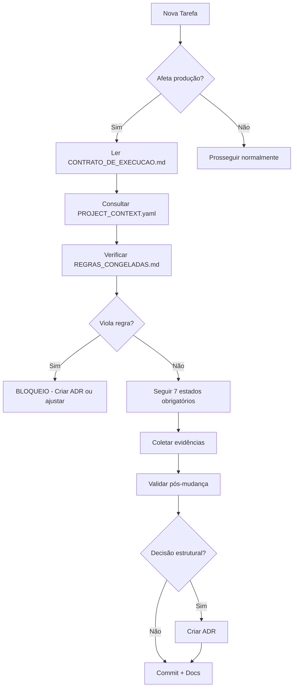

# 📚 ÍNDICE DE GOVERNANÇA

**Projeto**: Coding Day Trading  
**Atualizado**: 2026-01-02  
**Objetivo**: Centralizar toda documentação de controle e arquitetura

---

## 🎯 Documentos de Governança Ativa

### 1. **CONTRATO_DE_EXECUCAO.md** 🔒
**Função**: Regras imutáveis para execução de tarefas críticas  
**Quando usar**: Antes de TODA tarefa que afeta produção ou testes  
**Conteúdo-chave**:
- 7 estados obrigatórios (ANÁLISE → STATUS FINAL)
- Tipos de prova aceitáveis
- Proibições absolutas
- Critérios de bloqueio

**Status**: ✅ Ativo e obrigatório

---

### 2. **PROJECT_CONTEXT.yaml** 📋
**Função**: Contexto canonizado (fatos imutáveis sobre o projeto)  
**Quando usar**: Para consultar "o que é produção", "o que pode quebrar dinheiro", etc  
**Conteúdo-chave**:
- Canonical truths: What IS production, what NEVER IS
- Testing hierarchy (critical vs supplementary)
- Dependencies e data flow
- Pending uncertainties

**Status**: ✅ Ativo - consultar antes de classificar arquivos

---

### 3. **REGRAS_CONGELADAS.md** 🚫
**Função**: Princípios arquiteturais não reavaliáveis  
**Quando usar**: Para verificar se decisão viola regra existente  
**Principais regras**:
1. Separação de domínios (`experiments/` ≠ `src/`)
2. Scripts não são serviços
3. Impacto nulo exige prova (grep obrigatório)
4. Modificação de produção = validação obrigatória
5. `git mv`, nunca `rm`
6. Incertezas bloqueantes impedem conclusão
7. Zero perda de informação
8. ADR para decisões estruturais

**Status**: ✅ Ativo - violação invalida tarefa

---

### 4. **ADR/** (Architecture Decision Records)
**Função**: Registro de todas as decisões arquiteturais  
**Quando criar**: Ao mudar estrutura, remover módulo, alterar convenção  
**Formato**: `ADR-NNNN-titulo-descritivo.md`

**ADRs existentes**:
- `ADR-0001-separacao-categorias-funcionais.md` — Fase 1: Reorganização

**Status**: ✅ Ativo - consultar antes de refatorações grandes

---

## 📊 Documentos de Auditoria (Histórico)

### 5. **STRUCTURAL_AUDIT_PHASE1.md**
Classificação inicial de todos os 42 arquivos Python  
**Gerado**: Fase 1 - 2026-01-02

### 6. **STRUCTURAL_AUDIT_PHASE2_IMPACT.md**
Análise de impacto financeiro, operacional e de risco  
**Gerado**: Fase 2 - 2026-01-02

### 7. **PHASE1_UNCERTAINTY_RESOLUTION.md**
Resolução de incertezas via grep analysis  
**Resultado**: 8 arquivos confirmados impacto nulo

### 8. **STRUCTURAL_CLEANUP_PLAN.md**
Plano executável de reorganização estrutural (10 fases)  
**Status**: Fase 2 concluída, Fases 3-9 pendentes

### 9. **VALIDATION_REPORT.md**
Prova de que sistema funciona após limpeza  
**Evidências**: 11/11 testes unitários passando, imports OK

---

## 🔄 Workflow de Uso

### Para Tarefas Críticas:

### Para Consultas Rápidas:

| Pergunta | Consultar |
|----------|-----------|
| "Este arquivo é produção?" | `PROJECT_CONTEXT.yaml` → canonical_truths |
| "Posso mover X para Y?" | `REGRAS_CONGELADAS.md` → Regra #1, #2 |
| "Preciso provar impacto nulo?" | `REGRAS_CONGELADAS.md` → Regra #3 |
| "Por quê decidimos X?" | `ADR/ADR-NNNN-*.md` |
| "Como executar tarefa crítica?" | `CONTRATO_DE_EXECUCAO.md` → Estados 1-7 |

---

## 🛠️ Manutenção de Governança

### Revisão Obrigatória:
- **CONTRATO_DE_EXECUCAO.md**: A cada 10 tarefas críticas OU 6 meses
- **PROJECT_CONTEXT.yaml**: A cada mudança de arquitetura
- **REGRAS_CONGELADAS.md**: A cada 6 meses OU quando regra falha
- **ADRs**: Nunca deletar, apenas marcar como "Superado por ADR-XXXX"

### Criação de Novos Artefatos:
- ADR novo: Numeração sequencial (`ADR-0002`, `ADR-0003`, etc)
- Auditoria nova: Prefixo de data (`2026-01-15_AUDIT_*.md`)
- Regra nova: Adicionar a `REGRAS_CONGELADAS.md` com versão incrementada

---

## ✅ Checklist de Conformidade Completa

Antes de concluir QUALQUER tarefa crítica:

### Fase Preparatória:
- [ ] ✅ Lido `CONTRATO_DE_EXECUCAO.md`
- [ ] ✅ Consultado `PROJECT_CONTEXT.yaml` (contexto atualizado)
- [ ] ✅ Verificado `REGRAS_CONGELADAS.md` (sem violações)

### Durante Execução:
- [ ] ✅ Passou pelos 7 estados obrigatórios
- [ ] ✅ Coletou evidências (grep, testes, outputs)
- [ ] ✅ Resolveu incertezas bloqueantes

### Pós-Execução:
- [ ] ✅ Validou mudanças (testes passando)
- [ ] ✅ Criou ADR (se decisão estrutural)
- [ ] ✅ Commit com mensagem descritiva
- [ ] ✅ Atualizou `PROJECT_CONTEXT.yaml` (se aplicável)

---

## 🔗 Links Rápidos

| Documento | Path |
|-----------|------|
| Contrato de Execução | [`CONTRATO_DE_EXECUCAO.md`](CONTRATO_DE_EXECUCAO.md) |
| Contexto Canonizado | [`PROJECT_CONTEXT.yaml`](PROJECT_CONTEXT.yaml) |
| Regras Congeladas | [`REGRAS_CONGELADAS.md`](REGRAS_CONGELADAS.md) |
| ADRs | [`ADR/`](ADR/) |
| Plano de Limpeza | [`STRUCTURAL_CLEANUP_PLAN.md`](STRUCTURAL_CLEANUP_PLAN.md) |
| Validação Atual | [`VALIDATION_REPORT.md`](VALIDATION_REPORT.md) |

---

**Última atualização**: 2026-01-02 17:34 UTC-3  
**Mantido por**: Equipe de Arquitetura (humano + IA sob governança)
